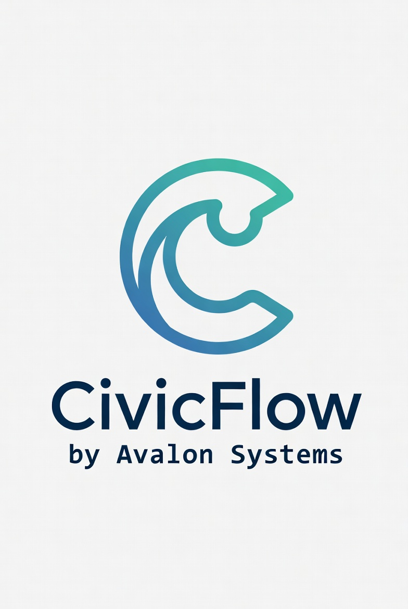

<!DOCTYPE html>
<html lang="en">
<head>
  <meta charset="UTF-8"/>
  <meta name="viewport" content="width=device-width, initial-scale=1.0"/>
  <title>CivicFlow | Township Workflow Automation for Microsoft 365</title>
  <link rel="preconnect" href="https://fonts.googleapis.com">
  <link rel="preconnect" href="https://fonts.gstatic.com" crossorigin>
  <link href="https://fonts.googleapis.com/css2?family=Playfair+Display:wght@500;600;700&family=Inter:wght@400;500;600;700&family=IBM+Plex+Mono:wght@400;500&display=swap" rel="stylesheet">
  
</head>
<body>

<!-- NAV -->
<header class="topbar">
  

    

      
    

    

      <a class="btn btn-secondary" href="#demo">See Demo</a>
      <a class="btn btn-primary" href="#cta">Get Your Workflow Mapped</a>
    

  

</header>

<!-- HERO -->
<section class="hero">
  

    

      
Township workflow automation · Microsoft 365

      <h1>Nothing falls through the cracks in your township anymore.</h1>
      
CivicFlow turns resident requests into tracked, assigned, and resolved cases — using the Microsoft 365 tools your team already has. No new software. No long rollout. Live in 14 days.

      

        
No new software

        
Built on Microsoft 365

        
Live in 14 days

        
AI assists. Humans decide.

      

      

        <a class="btn btn-primary btn-lg" href="#cta">See This In Your Township</a>
        <a class="btn btn-secondary btn-lg" href="#demo">Watch How It Works</a>
      

    

    

      

        
<strong>100%</strong>of requests tracked with a case number

        
<strong>&lt; 1 day</strong>same-day acknowledgment becomes standard

        
<strong>14 days</strong>from kickoff to live workflow

        
<strong>0 guesswork</strong>clear ownership, follow-up, and escalation

      

      

        
Designed for small township teams

        
Built for township administrators, clerks, trustees, and local government offices still handling resident requests through phone calls, email, paper forms, or scattered inboxes.

      

    

  

</section>

<!-- ORIGIN STORY -->
<section class="origin">
  

    

      
Built from real operational experience

      <h2>We didn't build this from the outside.</h2>
      
CivicFlow grew out of nine years of operational work inside The Avalon Foundation — a working organization where broken intake processes had real consequences for real people.

      
We didn't study this problem as consultants. We solved it under pressure with small teams, limited resources, and no margin for error. We know what breaks because we were the ones who had to fix it when it did.

      

        
We build for organizations where a dropped request isn't just an inconvenience — it's a failure of public trust. That's not a positioning statement. It's where we came from.

      

      
CivicFlow is a product of Avalon Systems · Northwest Ohio

    

    

      

        

          <strong>9</strong>
          Years of operational practice building and breaking real intake systems
        

        

          <strong>14</strong>
          Days from kickoff to a fully live workflow inside your Microsoft 365 tenant
        

        

          <strong>0</strong>
          New platforms required — everything runs inside what you already pay for
        

      

      

        
Why townships specifically

        
Small township offices handle the same volume and complexity as larger departments — with a fraction of the staff. When the process lives in one person's head, turnover becomes a crisis. CivicFlow makes the process survive the people, not the other way around.

      

    

  

</section>

<!-- PROBLEM -->
<section class="section">
  

    

      

        
The problem

        <h2>This is how most township requests are handled today.</h2>
        
Calls become sticky notes. Emails sit in a shared inbox. Paper forms land on a desk. Residents call back and staff have to start over because there is no case number, no ownership, and no audit trail.

        
It's not a staffing problem. It's not a motivation problem. The process was never designed — it just accumulated.

        

          <strong>When a resident calls back, you start over.</strong>
          That is the operational failure CivicFlow removes.
        

      

      

        
What happens today in most townships

        

          
✕Calls go to voicemail or get written down by hand

          
✕Emails sit in a shared inbox with no tracking

          
✕Paper forms live on a desk — not in a system

          
✕No case number for residents to reference later

          
✕No clear owner for who handles what next

          
✕Follow-up depends entirely on memory

          
✕When a key person leaves, the process leaves with them

        

      

    

  

</section>

<!-- FEATURE STRIP -->
<section class="section-tight">
  

    

      
What CivicFlow changes immediately

      <h2 style="color:#fff;margin-bottom:10px">Every request becomes a tracked case from the moment it is submitted.</h2>
      
Residents get acknowledgment. Staff get assignment clarity. Leadership gets visibility. Nothing gets lost.

      

        
<strong>Case ID</strong>Every request gets a reference number instantly — residents can follow up without starting over.

        
<strong>Auto-routing</strong>Zoning, roads, code, and admin requests go to the right person automatically.

        
<strong>Same-day acknowledgment</strong>Residents know their request was received before anyone manually touches it.

        
<strong>Built-in follow-up</strong>Escalations fire automatically if a case sits too long — no one has to remember.

      

    

  

</section>

<!-- BEFORE / AFTER -->
<section class="section">
  

    

      

        
Before CivicFlow

        <h3>Manual, inconsistent, hard to see</h3>
        

          
✕No unified intake — requests arrive through five different channels

          
✕Manual triage based on who saw it first

          
✕Inconsistent response timing and quality

          
✕No audit trail when questions arise later

          
✕No visibility into what's open, pending, or overdue

        

      

      

        
With CivicFlow

        <h3>Structured, visible, and in control</h3>
        

          
✓Every request captured in one place — regardless of how it arrived

          
✓Automatic routing by request type and urgency level

          
✓Consistent responses — same quality whether it's Monday or Friday

          
✓Full case history in SharePoint — permanent audit trail

          
✓Real-time visibility into every open case and its status

        

      

    

  

</section>

<!-- BANNER -->
<section class="section-tight">
  

    

      

        
Fast implementation

        <h2>You do not need new software or a long rollout.</h2>
        
CivicFlow runs inside Microsoft 365 using SharePoint, Forms, and Power Automate — tools most township offices already have. We configure the workflow around how your office actually operates. Your staff keeps using familiar tools.

      

      

        
<strong>No new logins</strong>Built entirely inside your existing Microsoft 365 environment

        
<strong>14-day install</strong>Workflow mapping, configuration, testing, and staff walkthrough

        
<strong>Human review</strong>No AI response goes out without staff approval — ever

        
<strong>Your data</strong>Everything stays inside your Microsoft 365 tenant — we don't host anything

      

    

  

</section>

<!-- DEMO -->
<section class="section" id="demo">
  

    
Interactive demo

    <h2>See exactly how a real request is handled.</h2>
    
Select a request type to walk through intake, routing, AI drafting, and follow-up — end to end. This is the same system that runs in Microsoft 365.

    

      

        

      

      

        

          <button class="demo-tab active" data-panel="zoning">🏗 Zoning Permit</button>
          <button class="demo-tab" data-panel="road">🚧 Road Complaint</button>
          <button class="demo-tab" data-panel="code">🏠 Code Complaint</button>
          <button class="demo-tab" data-panel="general">📋 General Concern</button>
        

        <!-- ZONING -->
        

          

            
<strong>✓ 1</strong>Form submitted

            
<strong>✓ 2</strong>Auto-routed

            
<strong>✓ 3</strong>Priority set

            
<strong>→ 4</strong>AI draft ready

            
<strong>5</strong>Staff review

            
<strong>6</strong>Response sent

            
<strong>7</strong>Follow-up

          

          

            

              
Case TWP-2026-0178 · April 13, 2026 · 3:42 PM

              <h4>Zoning Permit — Detached Garage Construction</h4>
              

                ● New
                Medium Priority
                Zoning Inspector
              

              
Sarah Thompson at 456 County Road 12 requests a zoning permit for a 24×30 detached garage. She has reviewed setback regulations and believes her project complies.

              
IF RequestType = "Zoning Permit" → WorkflowArea = "Zoning" → AssignedTo = Zoning Inspector → Priority = "Soon → Medium" → FollowUpDue = +7 days

              

                <strong>✦ AI Draft — awaiting staff review</strong>
                Dear Ms. Thompson, thank you for your zoning permit request. We have logged your application under case <strong>TWP-2026-0178</strong>. Our Zoning Inspector will review within 7 business days and contact you regarding next steps and payment.
              

            

            

              
Case timeline

              

                

<strong>3:42 PM</strong> — case created in SharePoint

                

<strong>3:42 PM</strong> — auto-routed to Zoning Inspector

                

<strong>3:42 PM</strong> — auto-reply with case ID sent to resident

                

<strong>3:43 PM</strong> — AI draft ready for staff review

                

<strong>Apr 20</strong> — follow-up reminder scheduled

              

              

                <strong style="display:block;margin-bottom:4px">Resident auto-reply sent immediately</strong>
                "Your request has been received under case TWP-2026-0178. You will hear from us within 7 business days."
              

            

          

        

        <!-- ROAD -->
        

          

            
<strong>✓ 1</strong>Form submitted

            
<strong>✓ 2</strong>Urgent route

            
<strong>✓ 3</strong>High priority

            
<strong>✓ 4</strong>AI draft ready

            
<strong>→ 5</strong>Staff review

            
<strong>6</strong>Response sent

            
<strong>7</strong>Escalation

          

          

            

              
Case TWP-2026-0179 · April 13, 2026 · 4:11 PM

              <h4>Road Complaint — Pothole Safety Hazard</h4>
              

                🔴 Urgent
                High Priority
                Roads Supervisor
              

              
Large pothole on eastbound County Road 8, approx. 0.5 miles north of US-20. Worsening after recent rain. Safety hazard — vehicles swerving to avoid it.

              
IF RequestType = "Road/Pothole" AND Urgency = "Urgent" → WorkflowArea = "Roads/Maintenance" → Priority = "Urgent → High" → AssignedTo = Roads Supervisor → FollowUpDue = +48 hours

              

                <strong>✦ AI Draft — awaiting staff review</strong>
                Dear Mr. Kowalski, thank you for reporting this hazard. Case <strong>TWP-2026-0179</strong> has been flagged urgent and assigned to our Roads crew. The location on County Road 8 will be assessed within 48 hours.
              

            

            

              
Case timeline

              

                

<strong>4:11 PM</strong> — case created, urgent flag detected

                

<strong>4:11 PM</strong> — high priority set, routed to Roads Supervisor

                

<strong>4:11 PM</strong> — resident auto-reply with case ID sent

                

<strong>4:12 PM</strong> — AI draft ready for staff review

                

<strong>Apr 15</strong> — escalation fires if unresolved

              

              

                <strong style="display:block;margin-bottom:4px">🚨 48-hour escalation window</strong>
                If Roads Supervisor has not updated the case by April 15 at 4:11 PM, an escalation alert fires automatically to the Township Administrator.
              

            

          

        

        <!-- CODE -->
        

          

            
<strong>✓ 1</strong>Form submitted

            
<strong>✓ 2</strong>Auto-routed

            
<strong>✓ 3</strong>Priority set

            
<strong>✓ 4</strong>AI draft ready

            
<strong>✓ 5</strong>Staff reviewed

            
<strong>→ 6</strong>Response sent

            
<strong>7</strong>Follow-up

          

          

            

              
Case TWP-2026-0180 · April 14, 2026 · 9:15 AM

              <h4>Code Complaint — Junk Vehicle Storage</h4>
              

                In Review
                Medium Priority
                Code Enforcement
              

              
Three unlicensed, apparently inoperable vehicles parked on front lawn at 812 Township Road 4 for over six months. Resident believes this violates township ordinances.

              
RequestType = "Code Complaint" → WorkflowArea = "Code Enforcement" → AssignedTo = Code Enforcement Officer → Priority = "Soon → Medium" → FollowUpDue = +7 days

            

            

              
Measured outcome

              <h4 style="color:var(--green)">32 minutes — submission to reply</h4>
              

                

<strong>9:15 AM</strong> — case created, routed to Code Officer

                

<strong>9:16 AM</strong> — AI draft ready for review

                

<strong>9:47 AM</strong> — officer reviews, approves, sends

                

<strong>Apr 21</strong> — follow-up deadline set

              

              

                <strong style="display:block;margin-bottom:4px">✓ Response sent in 32 minutes</strong>
                Staff reviewed the AI draft, confirmed it was accurate, approved — and sent. The workflow was already staged before anyone opened the case.
              

            

          

        

        <!-- GENERAL -->
        

          

            
<strong>✓ 1</strong>Form submitted

            
<strong>✓ 2</strong>Auto-routed

            
<strong>✓ 3</strong>Priority set

            
<strong>→ 4</strong>AI draft ready

            
<strong>5</strong>Staff review

            
<strong>6</strong>Response sent

            
<strong>7</strong>Follow-up

          

          

            

              
Case TWP-2026-0181 · April 14, 2026 · 11:02 AM

              <h4>General Concern — Drainage Ditch Overflow</h4>
              

                ● New
                Medium Priority
                Township Administrator
              

              
Drainage ditch along north side of 78 Township Road 11 overflowing onto lawn after heavy rain — third time this spring. Resident unsure whether this is a township or property-owner responsibility.

              
RequestType = "General Concern" → WorkflowArea = "General Admin" → AssignedTo = Township Administrator → FollowUpDue = +7 days

              

                <strong>✦ AI Draft — awaiting staff review</strong>
                Dear Mr. and Mrs. Meyers, thank you for reaching out. We have logged your drainage concern under case <strong>TWP-2026-0181</strong>. Our office will review and be in touch within 7 business days regarding responsibility and next steps.
              

            

            

              
Why this matters

              <h4>General requests stop disappearing.</h4>
              
This is often the biggest hidden gap. Requests that don't fit a narrow department category used to fall into a void. Now they have a case number, an owner, and a deadline.

              

                

<strong>11:02 AM</strong> — case created

                

<strong>11:02 AM</strong> — routed to Township Administrator

                

<strong>11:02 AM</strong> — resident auto-reply with case ID sent

                

<strong>11:03 AM</strong> — AI draft ready for review

                

<strong>Apr 21</strong> — follow-up deadline

              

            

          

        

      

    

  

</section>

<!-- HOW IT WORKS -->
<section class="section">
  

    
How it works

    <h2>What happens when a resident submits a request.</h2>
    
Simple enough for non-technical staff. Structured enough that nothing falls through the cracks regardless of who is in the office that day.

    

      

01
<h3>Resident submits</h3>
Online form, phone-assisted entry, or walk-in — captured in a consistent format every time.

      

02
<h3>Case is created</h3>
The request receives a reference number instantly inside Microsoft 365. Resident gets an auto-reply.

      

03
<h3>Auto-routing runs</h3>
Zoning, roads, code, and admin cases go to the right person automatically based on request type.

      

04
<h3>Priority is set</h3>
Urgent requests follow a 48-hour path. Routine requests follow a standard 7-day timeline.

      

05
<h3>AI drafts response</h3>
A staff-ready draft is prepared. Nothing goes out until a human reviews and approves it.

      

06
<h3>Follow-up is scheduled</h3>
If no action by the deadline, an escalation reminder fires automatically. Nothing gets forgotten.

    

  

</section>

<!-- RESULTS + RISK -->
<section class="section-tight">
  

    

      

        
What changes immediately

        <h3>Outcomes your township can feel within the first week</h3>
        

          
✓100% of requests tracked — nothing accepted without a case number

          
✓Same-day acknowledgment becomes the default, not the exception

          
✓Clear ownership on every case — no more "who has that?"

          
✓Response times drop — often to the same hour for routine requests

          
✓Follow-ups happen automatically — staff memory is no longer the system

          
✓The process survives staff changes — it lives in the system, not a person

        

      

      

        
Risk removal

        <h3>This is not a risky change for your office.</h3>
        

          
✓No data leaves Microsoft 365 — ever

          
✓No AI message goes out without staff review and approval

          
✓No replacement of staff judgment — CivicFlow supports it

          
✓No major disruption to go live — staff keep using familiar tools

          
✓No new software platform to buy, train on, or maintain

          
✓No long contract — cancel with 30 days notice

        

      

    

  

</section>

<!-- CTA -->
<section class="section" id="cta">
  

    

      
Get started

      <h2>See what this would look like in your township.</h2>
      
We will map your current intake process, show exactly where requests are slipping, and walk you through how CivicFlow would work in your Microsoft 365 environment.

      
No commitment required. Takes about 15–20 minutes. We assess fit before proposing anything.

      <a class="btn btn-primary btn-lg" href="https://forms.cloud.microsoft/r/MGmkKFT8v0" target="_blank" rel="noopener noreferrer">Get Your Workflow Mapped →</a>
      

        ✓ No commitment
        ✓ 15–20 minutes
        ✓ We assess fit first
        ✓ We respond within one business day
      

    

  

</section>

<footer>
  

    CivicFlow by Avalon Systems · Built for township administrators, clerks, trustees, and small local government teams · <a href="https://civicflow.us" style="color:var(--accent)">civicflow.us</a>
  

</footer>

  <a class="btn btn-primary" href="https://forms.cloud.microsoft/r/MGmkKFT8v0" target="_blank">Get Your Workflow Mapped →</a>

</body>
</html>
